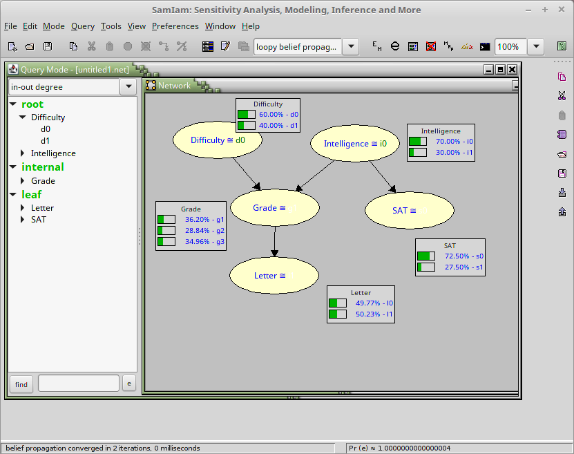

# SistemasInteligentesSemana9

-La siguiente Bayesian Network fue generada en base al modelo de StudentBayesianNetwork.
-Se hizo una implementación del método de VariableElimination y las probabilidades 
mostradas en la imagen son las mismas que las halladas en el archivo de Jupyter Notebook.

